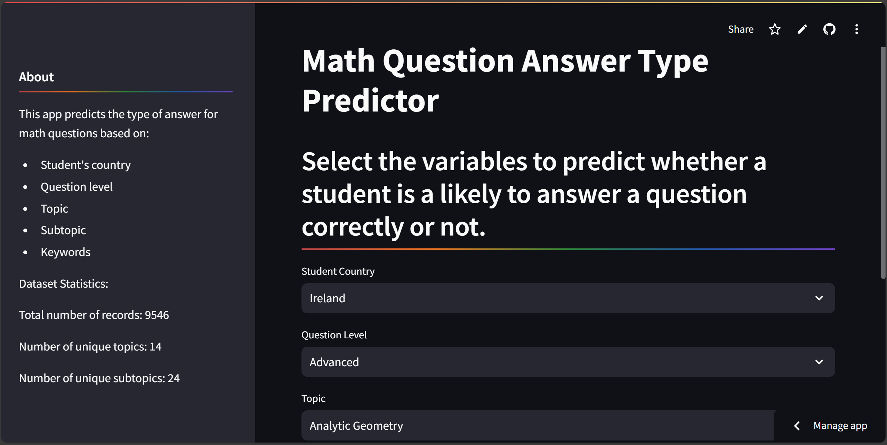

# [Comprehensive Analysis of Factors Affecting Mathematics Learning in Higher Education](https://result-answer.streamlit.app/ "Comprehensive Analysis of Factors Affecting Mathematics Learning in Higher Education")

## Overview
This project involves analyzing various factors influencing students' performance in answering mathematics questions in higher education and developing predictive and clustering models to better understand and improve learning outcomes. The study includes exploratory data analysis (EDA) of student responses, statistical testing for patterns and differences, machine learning classification models for prediction, and clustering techniques for grouping similar behaviors.

## Objectives
1. Investigate the impact of factors like Student Country, Question Level, Topic, Subtopic, and Keywords on students' performance.
2. Analyze and visualize differences in performance across countries and other variables using statistical and exploratory techniques.
3. Build predictive models to classify whether a student is likely to answer a question correctly or incorrectly.
4. Employ clustering techniques to identify patterns and group similar features among students or questions.

---

## 🚀 Key Results

- **Country-Level Insights**:  
  - Slovenia had the highest success rate (68.7%), followed by Romania (58.3%).  
  - Russia and Spain struggled the most, with success rates below 50%.

- **Topic-Level Performance**:  
  - Students excelled in *Set Theory* (64.3%) and *Graph Theory* (58.2%).  
  - The hardest topics were *Linear Optimization* (73.2% difficulty rate) and *Partial Differentiation* (67.6%).

- **Question Difficulty**:  
  - Advanced-level questions had a higher success rate (~50%) compared to basic-level questions (~46%).

- **Machine Learning Performance**:  
  - Gaussian Naïve Bayes outperformed other models, achieving an **F1 score of 0.62** after hyperparameter tuning.  
  - Clustering using *K-Means* and *Agglomerative Clustering* highlighted performance patterns, with Normalized data achieving the best silhouette scores (0.684 and 0.671, respectively).

---

## 🛠 Methods and Tools
### Data Analysis:
- **EDA:** Investigated distributions and patterns across countries, topics, and question levels.
- **Statistical Testing:** Used chi-squared tests to assess significant differences.

### Machine Learning:
- **Algorithms Used:** 
  - Logistic Regression
  - Gaussian Naïve Bayes
  - Decision Tree Classifier
  - Random Forest Classifier
  - XGBoost
- **Evaluation Metrics:** Accuracy, Precision, Recall, and F1 Score.
- **Hyperparameter Tuning:** Applied GridSearchCV on the Gaussian Naïve Bayes model.

- **Clustering Techniques Used:**
 - K-Means, Agglomerative Clustering, and DBSCAN to group students and questions based on feature similarities.
 - **Evaluation:**
 - Silhouette Score used to evaluate cluster quality.
 - **Key Findings:**
 - K-Means: Normalizer scaling achieved the highest silhouette score (0.684), indicating well-defined clusters.
 - Agglomerative Clustering: Normalizer scaling also yielded the best results (silhouette score: 0.671).
 - DBSCAN: MinMaxScaler worked best (silhouette score: 0.640), though Normalizer scaling classified most data as noise.

### Visualization:
- **Tools:** Plotly, Matplotlib, Pandas.
- **Examples:** Bar charts for topic and subtopic performance, stacked bar plots for country-wise correct vs incorrect answers.

### Tools and Libraries:
- **Programming Language:** Python
- **Key Libraries:** 
  - **Data Processing:** Pandas, NumPy
  - **Statistical Analysis:** SciPy
  - **Machine Learning:** Scikit-learn, XGBoost
  - **Visualization:** Plotly, Matplotlib
  - **App Development:** Streamlit

## 🖥 How to Use This Project
### Getting Started
To explore the analysis or run the code yourself:

1. Clone this repository to your local machine:
   git clone (git@github.com:kianakiashemshaki/Math-model.git)
2. pip install -r requirements.txt
   
---

## **Deployment**:
The project is deployed and accessible at the following URL:  
[View Deployment](https://result-answer.streamlit.app/)

### **Access via QR Code**:

--- 
## Contributors

- **Humphrey Borketey**
- **Kiana Kiashemshaki**
- **Uchechi Nwala**

